# Hi, I'm Mkbeh

  
  
  
  

    

## About me

I am a Software Engineer focused on building high-load systems, integrating AI solutions, and securing infrastructure.

▸ [ **𝐑&𝐃** ]

🖥️ **High-Load & Distributed Systems** — Designing fault-tolerant distributed systems and scalable backend
architectures.

🤖 **AI Integration** — Integrating LLMs into backend systems, building AI agents, and optimizing RAG pipelines.

🧰 **Cybersecurity & Linux** — Infrastructure security, vulnerability research, and custom networking tools.

▸ [ **𝐁𝐞𝐲𝐨𝐧𝐝 𝐓𝐞𝐜𝐡** ]

<kbd>💢 Anime & manga</kbd> · <kbd>🏂 Snowboarding</kbd> · <kbd>📚 Books</kbd> · <kbd>🍀 Gardening</kbd>

## Public Open Source Stats

This does not include any private repos such as my corporate work eg. where most of my Pull Requests and many of my
commits went.

This only includes my public open source repos:

  <picture>
    <source
      media="(prefers-color-scheme: dark)"
      srcset="./profile/stats-dark.svg"
    />
    <source
      media="(prefers-color-scheme: light), (prefers-color-scheme: no-preference)"
      srcset="./profile/stats-light.svg"
    />
    
  </picture>

  <picture>
    <source
      media="(prefers-color-scheme: dark)"
      srcset="./profile/top-langs-dark.svg"
    />
    <source
      media="(prefers-color-scheme: light), (prefers-color-scheme: no-preference)"
      srcset="./profile/top-langs-light.svg"
    />
    
  </picture>

## Core Public Repos

GitHub's limit of 6 pinned repos is far too low - these are what I consider my core open source public repos:

<!-- REPOS_START -->

### 🧩 Libraries

Reusable packages and SDKs for backend development, infrastructure, and integrations.

<a href="https://github.com/mkbeh/aiobitcoin">
  <picture>
    <source
      media="(prefers-color-scheme: dark)"
      srcset="./profile/aiobitcoin-dark.svg"
    />
    <source
      media="(prefers-color-scheme: light), (prefers-color-scheme: no-preference)"
      srcset="./profile/aiobitcoin-light.svg"
    />
    
  </picture>
</a>

<a href="https://github.com/mkbeh/xkafka">
  <picture>
    <source
      media="(prefers-color-scheme: dark)"
      srcset="./profile/xkafka-dark.svg"
    />
    <source
      media="(prefers-color-scheme: light), (prefers-color-scheme: no-preference)"
      srcset="./profile/xkafka-light.svg"
    />
    
  </picture>
</a>

<a href="https://github.com/mkbeh/xpg">
  <picture>
    <source
      media="(prefers-color-scheme: dark)"
      srcset="./profile/xpg-dark.svg"
    />
    <source
      media="(prefers-color-scheme: light), (prefers-color-scheme: no-preference)"
      srcset="./profile/xpg-light.svg"
    />
    
  </picture>
</a>

<a href="https://github.com/mkbeh/xclick">
  <picture>
    <source
      media="(prefers-color-scheme: dark)"
      srcset="./profile/xclick-dark.svg"
    />
    <source
      media="(prefers-color-scheme: light), (prefers-color-scheme: no-preference)"
      srcset="./profile/xclick-light.svg"
    />
    
  </picture>
</a>

<a href="https://github.com/mkbeh/xredis">
  <picture>
    <source
      media="(prefers-color-scheme: dark)"
      srcset="./profile/xredis-dark.svg"
    />
    <source
      media="(prefers-color-scheme: light), (prefers-color-scheme: no-preference)"
      srcset="./profile/xredis-light.svg"
    />
    
  </picture>
</a>

<a href="https://github.com/mkbeh/xjose">
  <picture>
    <source
      media="(prefers-color-scheme: dark)"
      srcset="./profile/xjose-dark.svg"
    />
    <source
      media="(prefers-color-scheme: light), (prefers-color-scheme: no-preference)"
      srcset="./profile/xjose-light.svg"
    />
    
  </picture>
</a>

<a href="https://github.com/mkbeh/pacecache">
  <picture>
    <source
      media="(prefers-color-scheme: dark)"
      srcset="./profile/pacecache-dark.svg"
    />
    <source
      media="(prefers-color-scheme: light), (prefers-color-scheme: no-preference)"
      srcset="./profile/pacecache-light.svg"
    />
    
  </picture>
</a>

### ⚙️ Tools

Standalone utilities, CLI tools, automation systems, and developer productivity projects.

<a href="https://github.com/mkbeh/pydrommer">
  <picture>
    <source
      media="(prefers-color-scheme: dark)"
      srcset="./profile/pydrommer-dark.svg"
    />
    <source
      media="(prefers-color-scheme: light), (prefers-color-scheme: no-preference)"
      srcset="./profile/pydrommer-light.svg"
    />
    
  </picture>
</a>

<a href="https://github.com/mkbeh/rin-bitshares-arbitry-bot">
  <picture>
    <source
      media="(prefers-color-scheme: dark)"
      srcset="./profile/rin-bitshares-arbitry-bot-dark.svg"
    />
    <source
      media="(prefers-color-scheme: light), (prefers-color-scheme: no-preference)"
      srcset="./profile/rin-bitshares-arbitry-bot-light.svg"
    />
    
  </picture>
</a>

<a href="https://github.com/mkbeh/arb-bot-rs">
  <picture>
    <source
      media="(prefers-color-scheme: dark)"
      srcset="./profile/arb-bot-rs-dark.svg"
    />
    <source
      media="(prefers-color-scheme: light), (prefers-color-scheme: no-preference)"
      srcset="./profile/arb-bot-rs-light.svg"
    />
    
  </picture>
</a>

<a href="https://github.com/mkbeh/caslex">
  <picture>
    <source
      media="(prefers-color-scheme: dark)"
      srcset="./profile/caslex-dark.svg"
    />
    <source
      media="(prefers-color-scheme: light), (prefers-color-scheme: no-preference)"
      srcset="./profile/caslex-light.svg"
    />
    
  </picture>
</a>

### 💡 Samples

Small projects, demos, and high-level examples exploring specific technologies, architectures, or patterns.

<a href="https://github.com/mkbeh/fastapi-admin-panel">
  <picture>
    <source
      media="(prefers-color-scheme: dark)"
      srcset="./profile/fastapi-admin-panel-dark.svg"
    />
    <source
      media="(prefers-color-scheme: light), (prefers-color-scheme: no-preference)"
      srcset="./profile/fastapi-admin-panel-light.svg"
    />
    
  </picture>
</a>

<a href="https://github.com/mkbeh/rust-simple-chat">
  <picture>
    <source
      media="(prefers-color-scheme: dark)"
      srcset="./profile/rust-simple-chat-dark.svg"
    />
    <source
      media="(prefers-color-scheme: light), (prefers-color-scheme: no-preference)"
      srcset="./profile/rust-simple-chat-light.svg"
    />
    
  </picture>
</a>

## Tech

I've worked on far too many technologies to list, but
here is a shortlist of some of the more still popular ones you might recognize:

<!-- Generated here:

    https://marwin1991.github.io/profile-technology-icons/

-->

   <table>
      <tr>
         <td><code></code></td>
         <td><code></code></td>
         <td><code></code></td>
         <td><code></code></td>
         <td><code></code></td>
         <td><code></code></td>
         <td><code></code></td>
      </tr>
	<tr>
		<td><code></code></td>
		<td><code></code></td>
		<td><code></code></td>
		<td><code></code></td>
		<td><code></code></td>
		<td><code></code></td>
		<td><code></code></td>
	</tr>
   </table>

